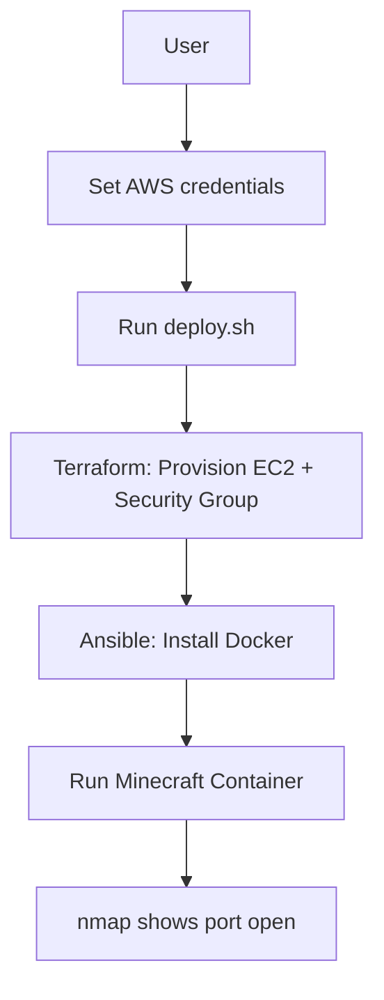

# Fully Automated Minecraft Server on AWS

## Background

This project provisions an EC2 instance using Terraform, then configures it using Ansible to run a Minecraft server inside a Docker container. The entire process is automated, meaning no manual AWS Console usage or SSH access to the server is required.

## Architecture Diagram



## Requirements

### Operating System

* Linux
* macOS
* Windows (WSL)

### Tools

* Terraform >= 1.5
* Ansible >= 8.0
* Git
* Nmap

### AWS Requirements

* AWS Academy Learner Lab with an active session
* AWS credentials:

  * AWS_ACCESS_KEY_ID
  * AWS_SECRET_ACCESS_KEY
  * AWS_SESSION_TOKEN

These credentials can be obtained from the AWS Details tab in AWS Academy.

## Setup and Commands

### 1. Clone the Repository

```bash
git clone https://github.com/ProvenAP/minecraft-automation.git
cd minecraft-automation
```

### 2. Configure AWS Credentials

```bash
source scripts/set_aws_credentials.sh
```

Enter the AWS Academy credentials when prompted.

### 3. Deploy the Infrastructure

```bash
chmod +x deploy.sh
./deploy.sh
```

This script will:

* Initialize Terraform
* Create the EC2 instance and security group
* Save the instance's public IP address
* Execute the Ansible playbook
* Install Docker
* Start the Minecraft server container

## Verification

After deployment, run:

```bash
nmap -sV -Pn -p T:25565 <instance-ip>
```

Replace `<instance-ip>` with the public IP displayed by the deployment script.

Expected output:

```text
PORT      STATE SERVICE   VERSION
25565/tcp open  minecraft Minecraft 26.1.2
```

This confirms that the Minecraft server is running and reachable.

## Resources

* https://hub.docker.com/r/itzg/minecraft-server
* https://registry.terraform.io/providers/hashicorp/aws/latest

## Assignment Information

This repository was created for the CS 312 System Administration Course Project Part 2.
